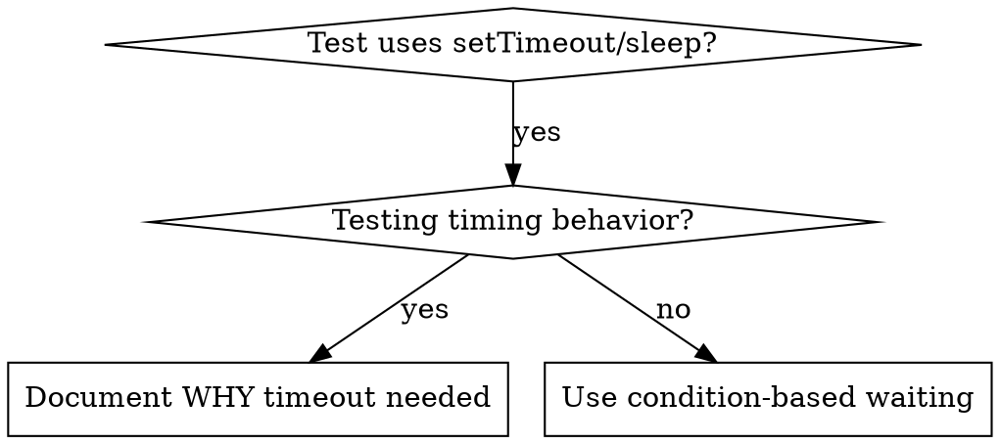

# Condition-Based Waiting

Adapted from `systematic-debugging/condition-based-waiting.md` (obra/superpowers, MIT
License). Part of the `yunicity-debugging` skill.

## Overview

Flaky tests often guess at timing with arbitrary delays. This creates race
conditions where tests pass on fast machines but fail under load or in CI.

**Core principle:** wait for the actual condition you care about, not a guess about
how long it takes.

## When to use



Use when:

- tests contain arbitrary delays (`setTimeout`, `sleep`);
- tests are flaky (pass sometimes, fail under load);
- tests time out when run in parallel;
- a test waits for an asynchronous operation to complete.

Do not use when testing actual timing behavior (debounce, throttle intervals). If an
arbitrary delay is truly needed, document why.

## Prefer the test framework's helper

If the project's test tooling already provides a condition-based wait (for example a
`waitFor` helper from its testing library), use it instead of writing your own. Do
not add a dependency for this unless the ticket allows it.

## Core pattern

```typescript
// ❌ BEFORE: guessing at timing
await new Promise(r => setTimeout(r, 50));
const result = getResult();
expect(result).toBeDefined();

// ✅ AFTER: waiting for the condition
await waitFor(() => getResult() !== undefined, 'result to be defined');
const result = getResult();
expect(result).toBeDefined();
```

## Quick patterns

| Scenario | Pattern |
|---|---|
| Wait for an event | `waitFor(() => events.find(e => e.type === 'DONE'), 'DONE event')` |
| Wait for a state | `waitFor(() => machine.state === 'ready', 'ready state')` |
| Wait for a count | `waitFor(() => items.length >= 5, 'five items')` |
| Complex condition | `waitFor(() => obj.ready && obj.value > 10, 'ready with value > 10')` |

## Implementation

A minimal polling helper, when the test tooling has none:

```typescript
async function waitFor<T>(
  condition: () => T | undefined | null | false,
  description: string,
  timeoutMs = 5000
): Promise<T> {
  const startTime = Date.now();

  while (true) {
    const result = condition();
    if (result) return result;

    if (Date.now() - startTime > timeoutMs) {
      throw new Error(`Timeout waiting for ${description} after ${timeoutMs}ms`);
    }

    await new Promise(r => setTimeout(r, 10)); // Poll every 10ms
  }
}
```

Domain-specific helpers (wait for an event of a given type, for a number of events,
or for an event matching a predicate) can be built on top of this helper: each one
reads fresh state inside `condition` and passes a precise `description`.

## Common mistakes

- **Polling too fast** (`setTimeout(check, 1)`) wastes CPU: poll every 10 ms or so.
- **No timeout** loops forever when the condition is never met: always include a
  timeout with a clear error.
- **Stale data**: caching state before the loop. Call the getter inside the
  condition.

## When an arbitrary delay is correct

```typescript
// waitForEvent: a domain helper built on waitFor (see above)
// Tool ticks every 100ms - need 2 ticks to verify partial output
await waitForEvent(manager, 'TOOL_STARTED'); // First: wait for the condition
await new Promise(r => setTimeout(r, 200));   // Then: wait for timed behavior
// 200ms = 2 ticks at 100ms intervals - documented and justified
```

Requirements:

1. first wait for the triggering condition;
2. base the delay on known timing, not on a guess;
3. add a comment explaining why.
