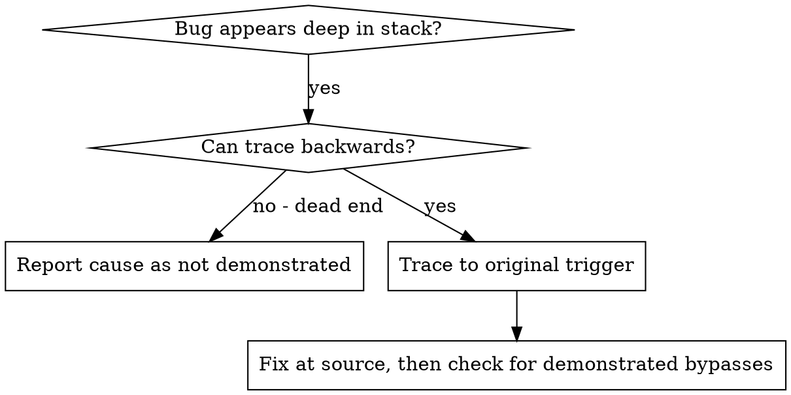
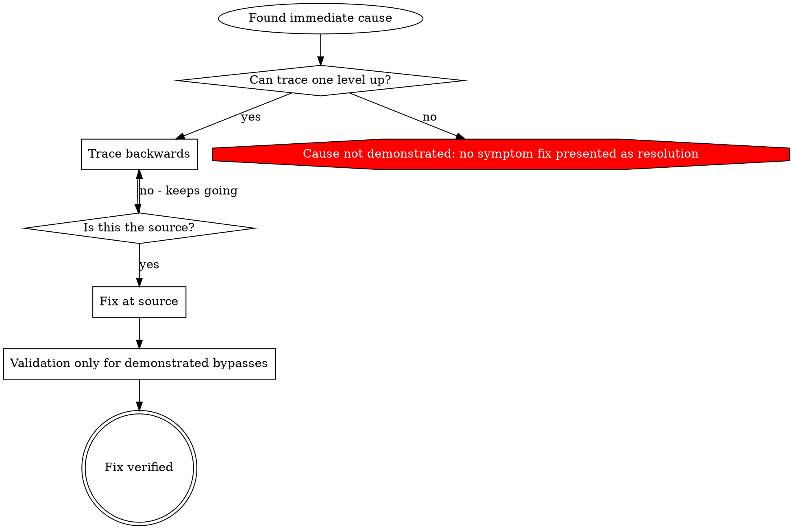

# Root Cause Tracing

Adapted from `systematic-debugging/root-cause-tracing.md` (obra/superpowers, MIT
License). Part of the `yunicity-debugging` skill; the diagnostic hygiene rules of
[SKILL.md](SKILL.md) apply.

## Overview

Bugs often show up deep in the call stack (a command run in the wrong directory, a
file created in the wrong place, a request sent to the wrong URL). The instinct is to
fix where the error appears, but that treats a symptom.

**Core principle:** trace backward through the call chain until you find the
original trigger, then fix at the source.

## When to use



At a dead end, follow "When no root cause is found" in [SKILL.md](SKILL.md): a
mitigation at the symptom point is possible only if justified, allowed by the
ticket and verified, and it is reported as a mitigation.

Use when:

- the error happens deep in execution, not at the entry point;
- the stack trace shows a long call chain;
- it is unclear where invalid data originated;
- you need to find which test or code path triggers the problem.

## The tracing process

The steps below use an illustrative example.

### 1. Observe the symptom

```
Error: git init failed in ~/project/packages/core
```

### 2. Find the immediate cause

What code directly causes this?

```typescript
await execFileAsync('git', ['init'], { cwd: projectDir });
```

### 3. Ask: what called this?

```
WorktreeManager.createSessionWorktree(projectDir, sessionId)
  → called by Session.initializeWorkspace()
  → called by Session.create()
  → called by test at Project.create()
```

### 4. Keep tracing up

What value was passed?

- `projectDir = ''` (empty string);
- an empty `cwd` resolves to `process.cwd()`;
- that is the source code directory.

### 5. Find the original trigger

Where did the empty string come from?

```typescript
const context = setupCoreTest(); // Returns { tempDir: '' }
Project.create('name', context.tempDir); // Accessed before beforeEach!
```

Fix at the source (here: make `tempDir` fail loudly if read before setup). Then
check whether another path bypasses that fix; add validation elsewhere only for a
demonstrated need (see [defense-in-depth.md](defense-in-depth.md)).

## Adding temporary instrumentation

When you cannot trace manually, log just before the problematic operation:

```typescript
// TEMPORARY DEBUG — remove before delivery
async function gitInit(directory: string) {
  const stack = new Error().stack;
  console.error('DEBUG git init:', {
    directory,
    cwd: process.cwd(),
    nodeEnv: process.env.NODE_ENV, // non-sensitive value
    stack,
  });

  await execFileAsync('git', ['init'], { cwd: directory });
}
```

- In tests, `console.error()` is usually visible where a logger may be silenced.
  This is acceptable only for temporary instrumentation, removed before delivery.
- Log only the context needed: paths, cwd, non-sensitive settings, timestamps,
  the stack. For environment variables, log the **name and whether it is set**,
  never a secret value (see "Diagnostic hygiene" in [SKILL.md](SKILL.md)).
- Paths, cwd and stack traces can contain personal data (for example a user name
  in a home directory, or personal file names). Mask them (for example replace the
  home directory with `~`) or reduce them to the elements needed for the diagnosis.
- Log **before** the dangerous operation, not after it fails.

Run and filter the output, using the project's test command:

```bash
<test command> 2>&1 | grep 'DEBUG git init'
```

Then analyze the stack traces: test file names, the line triggering the call, and
any pattern (same test, same parameter).

## Finding which test causes pollution

When something appears during the test run (a stray file, directory or state) and
you do not know which test creates it, bisect manually:

1. Make sure the artefact is absent before starting.
2. Run the test files one at a time (or in halves for large suites), using the
   project's test command.
3. After each run, check whether the artefact appeared.
4. The first run after which it appears points to the polluting test; confirm by
   running that test alone.

Do not delete or reset anything outside the ticket's scope while doing this.

## Key principle



Do not fix only where the error appears: trace back to the original trigger. When
the trigger cannot be found, the cause is not demonstrated; any change at the
symptom point is a mitigation and is reported as such.
